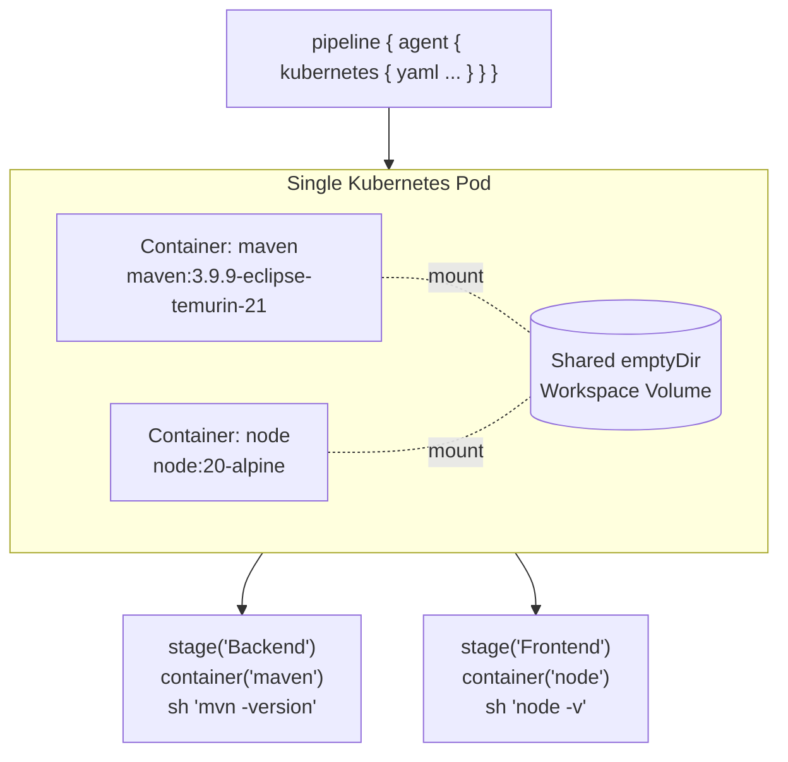
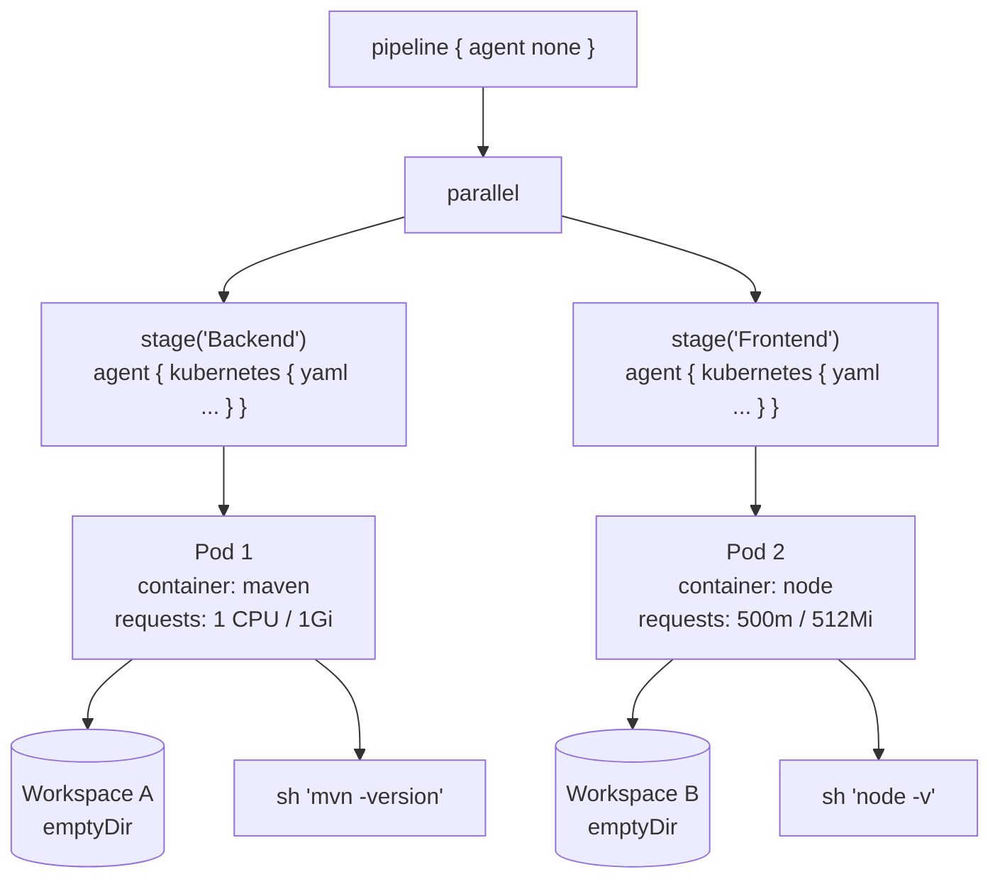
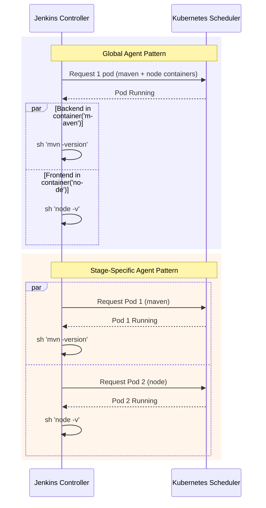
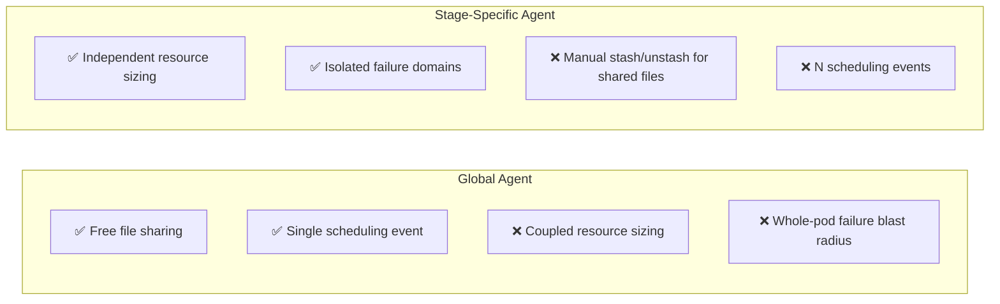
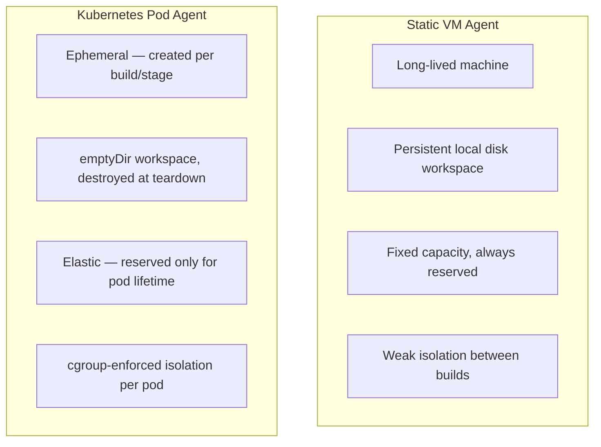
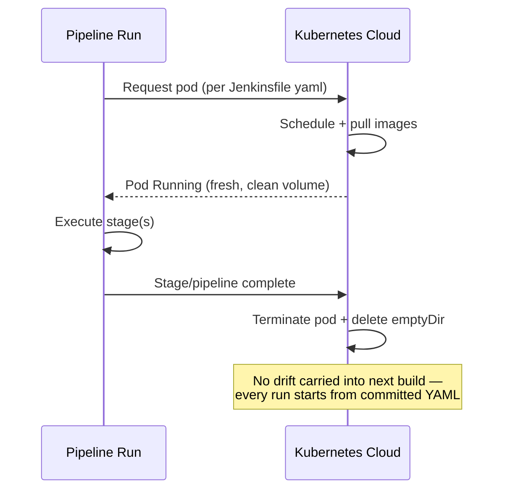
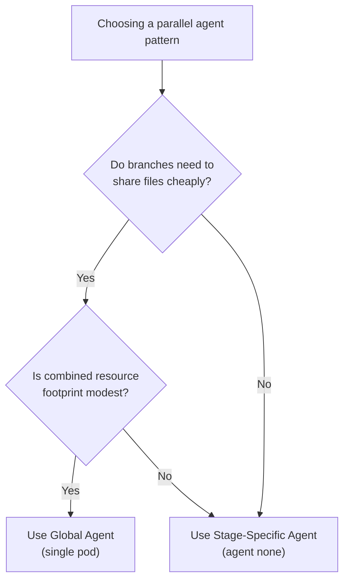

# Parallel Kubernetes Agent Patterns for Jenkins

Two architectures for running parallel build steps on Kubernetes pod agents

**Files covered:**
- `Jenkinsfile-global-agent`
- `Jenkinsfile-stage-agent`
- `README.md`

---

## Why Two Patterns?

Both pipelines do the same thing functionally:

- Build a **Backend** (Maven) branch
- Build a **Frontend** (Node.js) branch
- Run them **in parallel**

They differ in **where the Kubernetes pod boundary is drawn**:

| | Global Agent | Stage-Specific Agent |
|---|---|---|
| Top-level `agent` | `kubernetes { yaml }` | `none` |
| Pods per run | 1 | 2 (one per branch) |
| Workspace | Shared `emptyDir` | Isolated per pod |

---

## Pattern 1: Global Agent (Monolith)

`Jenkinsfile-global-agent` — one pod, two containers, shared workspace

**Key trait:** both branches execute inside the *same* pod — file sharing is free, resource sizing is coupled.

---

## Pattern 2: Stage-Specific Agent (Distributed)

`Jenkinsfile-stage-agent` — independent pods, isolated workspaces

**Key trait:** each branch schedules its *own* pod — resource sizing is independent, but workspaces are isolated by default.

---

## Scheduling Timeline Comparison

Global pattern pays **one** scheduling wait; distributed pattern pays **N** — but they can happen concurrently.

---

## Pros & Cons at a Glance

Full breakdown: see `README.md` §1 (executor starvation, resource bottlenecks, shared workspaces).

---

## Chapter 2: Pod Agents vs. Static VMs

The deeper architectural shift this whole comparison sits on top of.

---

## Ephemeral Lifecycle

Contrast with a static VM: the machine (and its workspace) **persists** across hundreds of builds unless actively wiped.

---

## Decision Guide

---

## Summary

- **Global Agent** → simplicity + free file sharing, at the cost of coupled sizing and blast radius
- **Stage-Specific Agent** → independent scaling + isolation, at the cost of explicit `stash`/`unstash` and more scheduling overhead
- **Kubernetes pods (either pattern)** → ephemeral, declarative, elastic — a fundamentally different operating model from long-lived static VM agents

**See also:**
- `README.md` — full technical write-up
- `Jenkinsfile-global-agent` — monolith pattern source
- `Jenkinsfile-stage-agent` — distributed pattern source
